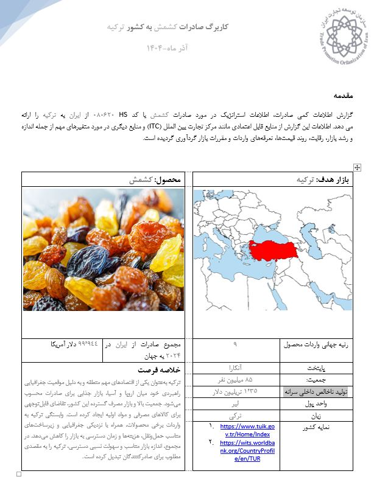

# Iran Raisins Export Market Intelligence

## Turkey Market & Alternative Export Opportunities

### Project Overview

This project provides a market intelligence analysis of Iranian raisin exports (HS 080620), with a primary focus on the Turkish market and selected alternative export destinations.

The analysis combines international trade data, market-access information, tariff conditions, non-tariff measures, competitive indicators, and export potential data to evaluate the attractiveness and risks of different markets for Iranian raisin exporters.

The project was developed as part of an International Trade Centre (ITC) training program focused on international trade intelligence and market-access analysis.

---

## Business Question

The main objective of this analysis was to answer the following questions:

- How attractive is Turkey as a market for Iranian raisins?
- What is Iran's current competitive position in the Turkish market?
- How has Iran's market share changed over time?
- How does Iran's export unit value compare with the Turkish market average and competing suppliers?
- What tariff disadvantages does Iran face compared with key competitors?
- What non-tariff measures and regulatory requirements affect market access?
- Which alternative markets could help reduce Iran's dependence on Turkey?
- What strategic actions could support export diversification?

---

## Product & Market

| Item | Description |
|---|---|
| Product | Raisins |
| HS Code | 080620 |
| Primary Market | Turkey |
| Exporting Country | Iran |
| Analysis Period | 2020–2024 |
| Main Focus | Market attractiveness, competitiveness & market access |

---

## Data Sources & Tools

The analysis was conducted using international trade and market-access intelligence platforms.

### International Trade Centre (ITC)

- **Trade Map** — Trade flows, market size, growth, competitors, market shares and unit values
- **Market Access Map (MacMap)** — Tariffs and market-access conditions
- **Export Potential Map** — Identification of potential export markets
- **ePing SPS & TBT Platform** — Sanitary, phytosanitary and technical regulatory notifications
- **Rules of Origin Facilitator** — Rules of origin and preferential trade requirements

Additional country-level information was referenced from:

- Turkish Statistical Institute (TÜİK)
- World Integrated Trade Solution (WITS)

---

# Analysis

## 1. Turkey Market Size

In 2024, Turkey imported approximately **US$66.5 million** worth of raisins from the world, representing approximately **3.2% of global raisin imports**.

Iran supplied approximately **US$26.7 million** of Turkey's raisin imports, giving Iran an estimated **40.1% share** of the Turkish import market.

This indicates that Iran currently holds a strong position in the Turkish market.

---

## 2. Market Growth

Turkey's raisin imports increased by approximately **7% annually** over the five-year period analyzed.

This growth was higher than the approximately **4% annual growth of global raisin imports**, indicating that Turkey's share of global raisin imports increased during the period.

However, Iranian raisin exports to Turkey declined by approximately **3% annually** over the same period.

### Key implication

Iran's exports declined while the overall Turkish market expanded.

This represents a warning signal because maintaining a large current market share does not necessarily guarantee future competitiveness.

The trend suggests the need to examine:

- Competitive pressure
- Pricing strategy
- Product differentiation
- Market positioning
- Regulatory compliance
- Relationships with importers and distributors

---

## 3. Export Unit Value

In 2024:

| Indicator | Unit Value |
|---|---:|
| Turkey's average raisin import unit value | US$2,275 / ton |
| Global average unit value | US$2,361 / ton |
| Iran's export unit value to Turkey | US$2,336 / ton |

Iran's unit export value was slightly above Turkey's overall import-market average.

However, unit value should not be interpreted as a direct measure of product quality.

Differences in unit values may reflect factors such as:

- Product mix
- Quality and grading
- Variety/type of raisins
- Processing
- Packaging
- Branding
- Contract conditions
- Buyer requirements

Among major suppliers, reported unit values showed a relatively narrow range, suggesting that price differentiation in the Turkish raisin market may be relatively limited.

---

## 4. Competitive Landscape

Turkey's raisin import market is relatively diversified, although the largest suppliers hold substantial shares.

### Major suppliers in 2024

| Supplier | Market Share |
|---|---:|
| Iran | 40.1% |
| Uzbekistan | 30.3% |
| Afghanistan | 14.5% |

Iran remains the largest supplier among the three.

However, several competing suppliers increased their market shares over the five-year period, including:

- Uzbekistan
- Afghanistan
- South Africa
- China
- Germany

### Key implication

Iran's current market leadership should not be viewed as permanent.

The combination of declining Iranian export value and increasing market shares of several competitors suggests increasing competitive pressure in Turkey.

---

# 5. Tariff & Market Access Analysis

One of the most important findings of the analysis is Iran's tariff disadvantage.

Iran does not benefit from preferential tariff access for raisins in Turkey.

The general/MFN tariff applicable to the analyzed raisin tariff lines is approximately:

**54.9%**

In contrast, Uzbekistan benefits from a **0% tariff** for the relevant tariff lines.

### Tariff comparison

| Country | Indicative Tariff |
|---|---:|
| Iran | 54.9% |
| Uzbekistan | 0% |
| Afghanistan | No preferential rate identified |
| South Africa | No preferential rate identified |

This creates a significant competitive disadvantage for Iranian exporters, particularly against Uzbekistan.

The tariff difference can directly affect the final market price and therefore the competitiveness of exporters.

---

# 6. Non-Tariff Measures

Tariffs are not the only market-access consideration.

The analysis identified several non-tariff measures relevant to the Turkish market, including:

- **A14** — Authorization requirements for SPS reasons
- **A15** — Authorization requirements for importers for SPS reasons
- **A83** — Certification requirements
- **A84** — Inspection requirements
- **C3** — Requirements to pass through specified customs ports
- **C4** — Import monitoring, surveillance and automatic licensing measures

These requirements increase the importance of regulatory compliance and operational planning for Iranian exporters.

---

# 7. New SPS Requirement

An important regulatory notification identified through the ePing platform was:

**G/SPS/N/TUR/141**

The notification introduced import requirements covering several products, including dried Corinthian grapes.

According to the notification analyzed in this project, from **31 March 2024**, a phytosanitary certificate was required for the relevant raisin tariff line.

At entry into Turkey, shipments may be subject to quarantine controls.

Non-compliance may result in actions such as:

- Rejection/return of the shipment
- Destruction of the shipment

### Business implication

For Iranian exporters, regulatory compliance is therefore not simply an administrative issue.

Failure to meet SPS and quarantine requirements can potentially result in:

- Additional costs
- Delays
- Shipment rejection
- Loss of market access
- Reputational damage

Exporters therefore need appropriate coordination with relevant plant-health authorities and Turkish import requirements before shipment.

---

# 8. Alternative Export Markets

The analysis also examined alternative destinations to reduce dependence on the Turkish market.

## Regional Opportunities

### Kuwait

Kuwait represents a potentially attractive regional market because of:

- High purchasing power
- Demand for food products and dried fruits
- Geographic proximity
- Existing trade relationships with Iran

Although the market is smaller than Turkey, its characteristics may make it useful as part of a diversification strategy.

### Oman

Oman offers potential due to:

- Growing food import demand
- Its strategic position in regional trade
- Geographic proximity
- Potential logistics advantages

Increasing Iran's market share may require stronger marketing, improved packaging and consistent compliance with food-safety and technical requirements.

### Qatar

Qatar is another potentially attractive market due to:

- High purchasing power
- High dependence on food imports
- Demand for dried fruits
- Geographic proximity to Iran

Existing Iranian participation in the market also provides a potential foundation for further development.

---

# Global Opportunities

## China

China represents a large potential market due to:

- Large population
- Significant food import demand
- Growing consumption of dried fruits
- Large overall market size

However, regulatory requirements, quality standards and competition can create significant entry barriers.

---

## India

India offers potential because of:

- Large population
- Growing food consumption
- Significant use of raisins in food processing and confectionery
- Large potential market size

The main challenges include strong price competition and market-access requirements.

---

## Germany

Germany represents a strategic European market because of:

- High purchasing power
- Strong demand for dried fruits
- Importance as a European distribution and re-export hub

However, exporters would need to address:

- EU food-safety requirements
- Quality standards
- Packaging requirements
- Traceability
- Tariff and regulatory conditions
- Strong competition

---

# Key Findings

### 1. Turkey is a large but highly competitive market

Turkey ranks among the world's major raisin-importing markets and has experienced faster import growth than the global market.

However, Iranian exporters face a significant tariff disadvantage.

---

### 2. Iran has a strong current position but faces a warning signal

Iran held approximately **40.1%** of Turkey's raisin import market in 2024.

However, Iranian exports to Turkey declined by approximately **3% annually** over the previous five years while the Turkish market grew.

This suggests increasing competitive pressure.

---

### 3. Iran faces a major tariff disadvantage

Iran does not benefit from preferential tariff access, while Uzbekistan benefits from a **0% tariff** for the analyzed tariff lines.

This creates an important structural competitive disadvantage.

---

### 4. Regulatory compliance is strategically important

SPS requirements, certification, inspection and quarantine controls represent important market-access considerations.

The identified 2024 SPS notification further emphasizes the importance of regulatory preparedness.

---

### 5. Market diversification can reduce export risk

Kuwait, Oman and Qatar offer potentially attractive regional opportunities because of their purchasing power, food-import dependence and geographic proximity.

Larger markets such as China, India and Germany may provide greater long-term potential but require stronger capabilities in quality, compliance, packaging and market development.

---

# Strategic Recommendations

Based on the analysis, the following strategic directions are suggested:

### Short Term

- Maintain and protect Iran's existing position in Turkey.
- Improve regulatory compliance and SPS preparedness.
- Monitor competitors, particularly Uzbekistan and Afghanistan.
- Investigate the reasons behind the decline in Iranian exports.
- Strengthen relationships with Turkish importers and distributors.

### Medium Term

- Expand into regional markets such as Kuwait, Oman and Qatar.
- Improve packaging, product differentiation and market positioning.
- Develop stronger market-specific marketing strategies.
- Monitor tariff and regulatory developments continuously.

### Long Term

- Evaluate larger markets such as China, India and Germany.
- Invest in quality certification and traceability.
- Improve packaging and branding capabilities.
- Build a diversified export portfolio rather than relying heavily on a single destination.

---

# Business Insight

The central finding of this analysis is that **Iran's current market share in Turkey should not be considered sufficient evidence of long-term competitiveness**.

Iran remains a major supplier, but the combination of:

**High tariff disadvantage + declining Iranian exports + increasing competition + tighter SPS requirements**

creates a strategic risk for future market performance.

A more resilient export strategy would combine:

**Market retention in Turkey**

+

**Regional market diversification**

+

**Long-term development of larger international markets**

This approach could reduce market concentration risk while creating opportunities for sustainable export growth.

---

# Project Skills Demonstrated

This project demonstrates practical experience in:

- International Trade Analysis
- Market Intelligence
- Market Research
- Competitive Analysis
- Market Sizing
- Market Growth Analysis
- Trade Data Analysis
- Export Market Identification
- Tariff Analysis
- Non-Tariff Measures (NTMs)
- SPS/TBT Analysis
- Market Access Analysis
- Data Interpretation
- Business Insight Generation
- Strategic Recommendations

---

# Tools

| Tool | Purpose |
|---|---|
| ITC Trade Map | Trade flows, market size, growth and competitors |
| ITC Market Access Map | Tariffs and market-access conditions |
| ITC Export Potential Map | Export opportunity identification |
| ePing | SPS/TBT notifications and regulatory measures |
| Rules of Origin Facilitator | Rules of origin and preferential trade analysis |
| Excel | Data analysis and report preparation |

---

# Data Sources

- [ITC Trade Map](https://www.trademap.org/)
- [ITC Market Access Map](https://www.macmap.org/)
- [ITC Export Potential Map](https://exportpotential.intracen.org/)
- [ePing SPS & TBT Platform](https://epingalert.org/)
- [Rules of Origin Facilitator](https://findrulesoforigin.org/)
- [Turkish Statistical Institute (TÜİK)](https://www.tuik.gov.tr/)
- [World Integrated Trade Solution (WITS)](https://wits.worldbank.org/)

---

# Deliverables

- Market Intelligence Fact Sheet
- Turkey Market Analysis
- Competitive Landscape Analysis
- Tariff & Market Access Analysis
- Non-Tariff Measures Analysis
- SPS Regulatory Analysis
- Alternative Market Assessment
- Strategic Export Recommendations

---

## Disclaimer

This project was developed for analytical and educational purposes as part of an International Trade Centre (ITC) training program.

Trade values, tariffs, market shares and regulatory information reflect the data and information available through the referenced sources during the period of analysis. Market conditions, tariffs and regulatory requirements may change over time.

The analysis represents an independent interpretation of the available data and should not be considered official trade, legal or regulatory advice.
